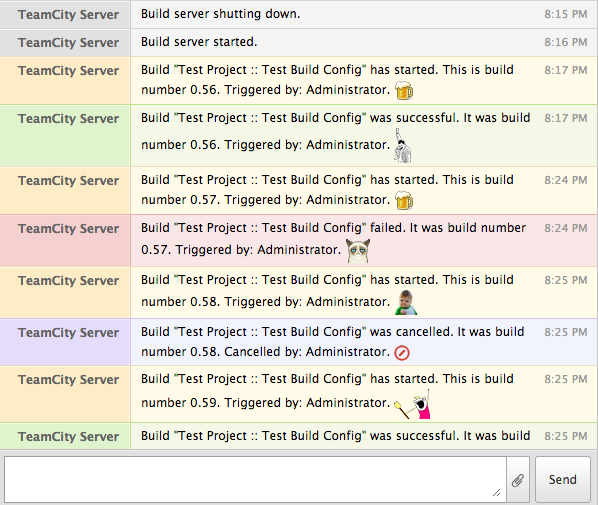

TeamCity-HipChat-Notifier
=========================

A fun TeamCity HipChat Notifier for sending build server notifications to a HipChat room, using colours and emoticons.

# Installation

[Download](https://github.com/parautenbach/TeamCity-HipChat-Notifier/releases/latest) the ZIP file release, drop it in your TeamCity installation's `.BuildServer/plugins/` 
directory (as explained by [Jetbrains](http://www.jetbrains.com/teamcity/plugins/)) and restart the server. 

[Visit](http://www.whatsthatlight.com/index.php/projects/teamcity-hipchat-plugin/) my website for more detailled instructions and information.

Note: I've tested the plugin with TeamCity 8. Support for older versions are uncertain, but I would gladly provide information and experiences by others here. 

# Configuration

On HipChat, create a user account to represent the build server and generate a token for that user. 
Note: There are two HipChat APIs, so ensure your token is for the v2 API and not the v1 API. 

On TeamCity, as an administrator, configure the generated token and other settings on the Administration panel.

# Developers

* This is an Eclipse project. To open the project in Eclipse go to _File -> Import -> General -> Existing Projects into Workspace -> Select root directory_. Navigate to the folder with HipChat Notifier source code. You can consider to use the Mylyn Github connector for Eclipse.  
* Clone the repository and set the `teamcity.home` property in the `build.xml` to your TeamCity server's home directory (Windows users, use forward slashes in the path, e.g. `C:/TeamCity`). 
* Set the `TEAMCITY_HOME` classpath variable under Eclipse preferences to the same location as above. 
* Check that Eclipse knows where to find a JDK (under Installed JREs in the Java section of Eclipse preferences). 
* On Windows make sure that you have `JAVA_HOME` variable set to where your JDK is installed, e.g. `C:\Program Files\Java\jdk1.7.0_51`.
* To release the project as a TeamCity plugin right click on `build.xml` and select _Run As -> 2 Ant Build_. Check the release target and run. The plugin package will be created under a `build` folder.

For debugging, add the snippets in `teamcity-server-log4j.xml` in this project's root to `conf/teamcity-server-log4j.xml` and then monitor `logs/hipchat-notifier.log `.

# Future Improvements

* Configurable notification message templates, with their colours and emoticon sets: It could be nice for users to customise these, or translate them into the language of their choice. 
* Implement more events: Right now the supported events seem sufficient. 
* Use @ mentions to send guaranteed messages to persons that have contributed to a failed build: This could add a lot of clutter. 
* Add more build statistics, such as the number of tests passed and failed.

# Changelog

## Version 0.4.2
* Enhancement: Made the project/build configuration a clickable link.

## Version 0.4.1
* Enhancement: List the contributors to a build (if available).

## Version 0.4.0
* Feature: Clickable links in messages to the build.

## Version 0.3.1
* Bug: Project configuration tab didn't use room ID aliases when inheriting from the default or parent configuration. 

## Version 0.3.0 

* Feature: Disable or enable build and server events. 

## Version 0.2.0 

* Feature: Allow setting different rooms for different projects, and allow to use the default configuration or none, or inherit from the parent project. As a consequence, server up and down events are sent to only the default room, if configured.
* Improvement: Instead of entering a room ID, it can now be selected from a dropdown list of available rooms.
* Improvement: Added a button on the configuration page to test the API credentials.
* Bug: Fixed UI bug where disabling the plugin after saving settings didn't respond.

## Version 0.1.0

* First release.
